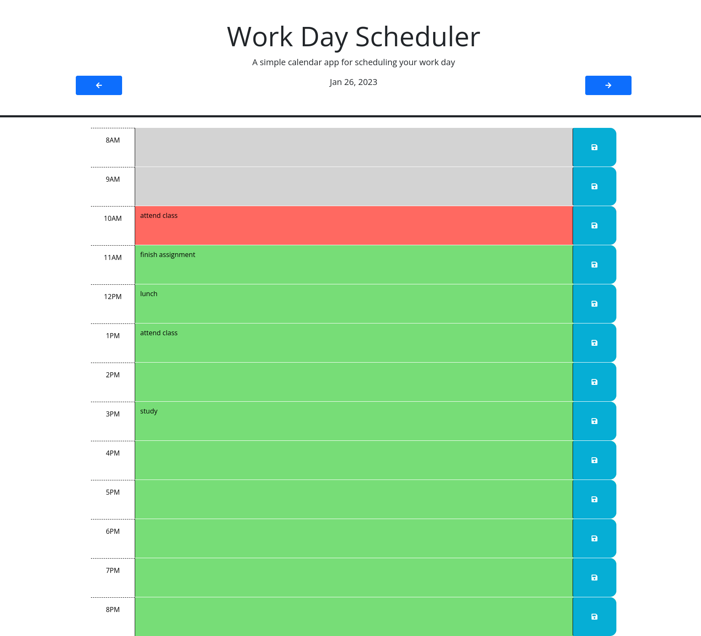
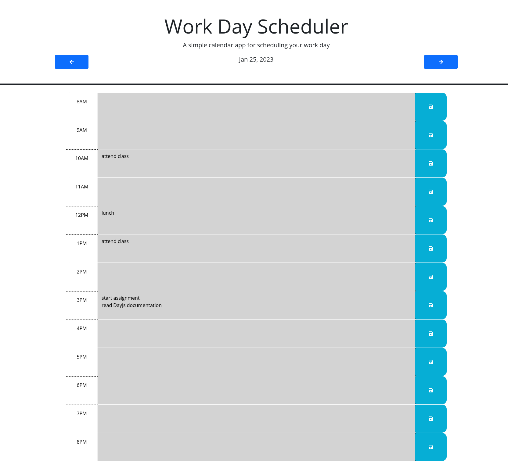
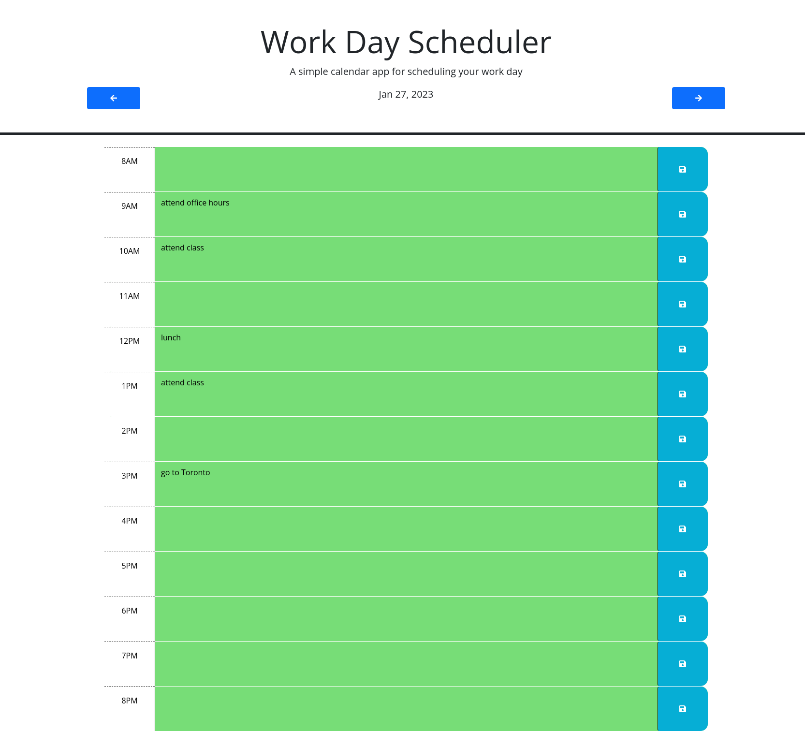

# UTOR-MOD05-CHAL01-Weekday-Planner
University of Toronto - Module 05 - Challenve 01 - Weekday Planner

## Description

Repository containing the code for the Workday Scheduler. The website is a single page presenting the user with entries for the each hour in between 8am and 8pm. The user is able to enter data for any selected hour and save the entry. 

The user is also able to navigate through other days of the week and be presented with that day's entries. 

The website is done using HTML, CSS, and JavaScript utilizing the Bootsrap and jQuery. The Workday Scheduler also colour the scheduler based on time of day - gray for "the past"; green for the "future"; and red for the present hour. 

Below is the image of the application when the user lands on the page - it defaults to the current date

Below is the image of the application when the user changes the date to a date in the past

Below is the image of the application when the user changes the date to a date in the future

## Table of Contents

- [Installation](#installation)
- [Functionality](#functionality)
- [Usage](#usage)
- [Credits](#credits)
- [License](#license)

## Installation

No installation requirements. Click the URL https://scorpionfiko.github.io/UTOR-MOD05-CHAL01-Week-Day-Scheduler/ to open the webpage in your default browser.

## Functionality

The following discusses at a high level about some of the features of the website. Detailed code implementation can be found as comments in the JS files.

### Calendar Entry:

The calendar entries are dynamically created in the JS file between the startTime and endTime as (currently) hardcoded in the JS file. The current values are startTime = 8am and endTime = 8pm. This is done in order to easily change the calendar entries just by changing one or two numbers. This also eliminate the copy/paste errors if all the entries had to be written in the HTML file. jQuery has been used to create the elements as well as give them the necessary unique ID.

### Page Transformation:

The most notable page transformation is the colour changes based on the day and hour of the day. Dayjs is used to compare the "calendar day" to the current day (returned by dayjs). 
- if the calendar day is in the past OR if the calendar day is current date, but the hour is in the past - then calendar is coloured gray
- if the calendar day is in the future OR if the calendar day is current date, but the hour is in the future - then calendar is coloured green
- if the other two conditions above are not satisfied, it is present hour where the background is coloured red.

### Local Storage:

All non-empty calendar entries are stored in an object array per the calendar day. The local storage key is the date in "YYYY-MM-DD" format; the value is the object array. This way the user can traverse dates in the past or future. Using the "YYYY-MM-DD" format is necessary as that is the format accepted by dayjs.

## Usage

For accessing the quiz: 

- go to the application at: https://scorpionfiko.github.io/UTOR-MOD05-CHAL01-Week-Day-Scheduler/
- add any event in the calendar and click the corresponding save button.
- traverse any future or past days and add events (step above)

For viewing the responsiveness of the website: 
Method 1:

- Use separate computer, tablet, or phone to access the website

Method 2:

- Access the web page via web browser.
- Right click on the page and select "inspect" to open browser's developer tools
- Enable the device toolbar if not already enabled
- Use the device toolbar on the right to grow or shrink the viewable area and see how items change

## Credits

N/A

## License

Please refer to the LICENSE in the repo.

## Future Considerations

### Difficulty level

Below are some thoughts for future upgrades:
- add timer so that once the hour turns, the corresponding calendar entry automatically gets coloured.
- add a form for user workday hours input per day. Currently they are hard coded from 8am to 8pm for all days.
- add "out of office" colour
- prevent user from deleting or updating past events.
